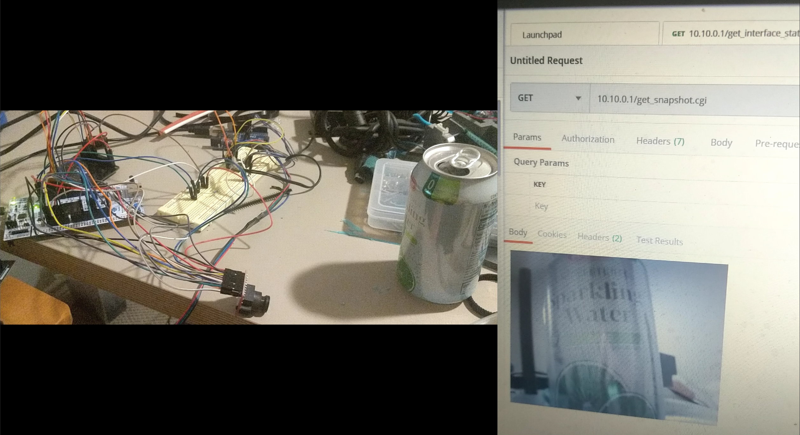

# STM32 Wifi Camera

A working configuration of an STM32 Microcontroller transmitting images via an API over a private network. 

The STM32-NUCLEO board is connected to the Silicon Lab's WF200 wifi board via SPI. The camera used is an OV2640 transmitting 8 bit JPEG compressed data, and the OV2640 is initialized via SCCB (basically I2C)

Utilizing the lwIP webserver, the "virtual" filesystem (in folder fs) contains a 640x480 image, and upon an http request for the camera image, the image is obtained (via DMA) and overwritted in the fs image's place, which then gets transmitted via wifi. This is a hacky implementation, but planning on integrating custom files in the lwIP server later.

